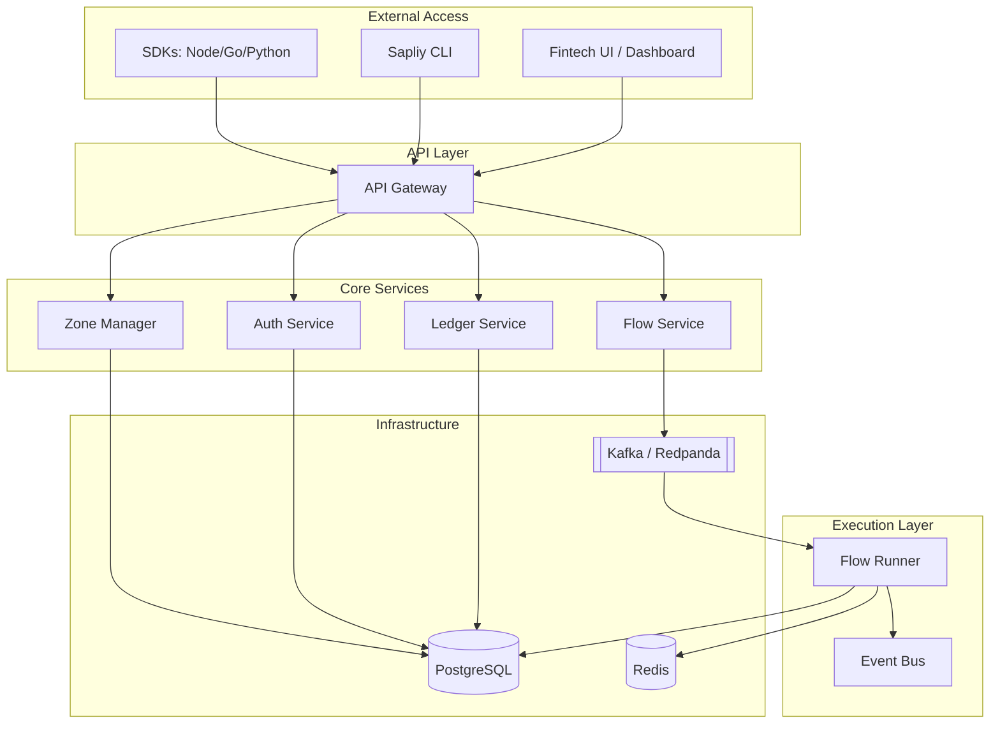

# System Architecture

Sapliy is a distributed event-driven platform built for scale, resilience, and security. It consists of multiple Go-based microservices that communicate via high-performance messaging systems.

## Microservices Overview

### 1. API Gateway
The entry point for all external traffic. Handles:
- **Rate Limiting**: Per organization and per zone.
- **Authentication**: Validates API keys and JWTs.
- **Request Routing**: Proxies requests to internal gRPC/REST services.

### 2. Flow Service & Runner
- **Flow Service**: Manages the lifecycle of automation flows (CRUD, enable/disable, versioning).
- **Flow Runner (The Engine)**: A specialized worker that consumes events from the queue and executes the visual logic nodes. It is stateless and highly scalable.

### 3. Zone Manager
Maintains the logical isolation of environments. It ensures that data, keys, and execution contexts for "Test" and "Live" modes never intersect at the application layer.

### 4. Ledger Service
The source of truth for all financial state. It processes transaction events emitted by the Flow Runner and updates double-entry ledger records in PostgreSQL.

## Communication Patterns

- **Synchronous (REST/gRPC)**: Used for management actions (e.g., creating a flow, listing zones).
- **Asynchronous (Kafka/RabbitMQ)**: Used for event ingestion and flow execution. This ensures that a spike in payment events doesn't bring down the API.
- **Stateful (Redis)**: Used for idempotency checks, session management, and real-time execution tracking.

## Deployment Models

- **SaaS**: Multi-tenant architecture running on Sapliy's managed cloud.
- **Self-Hosted**: Packaged as Docker images and Helm charts for deployment in your own VPC (AWS, GCP, Azure, or On-prem).
