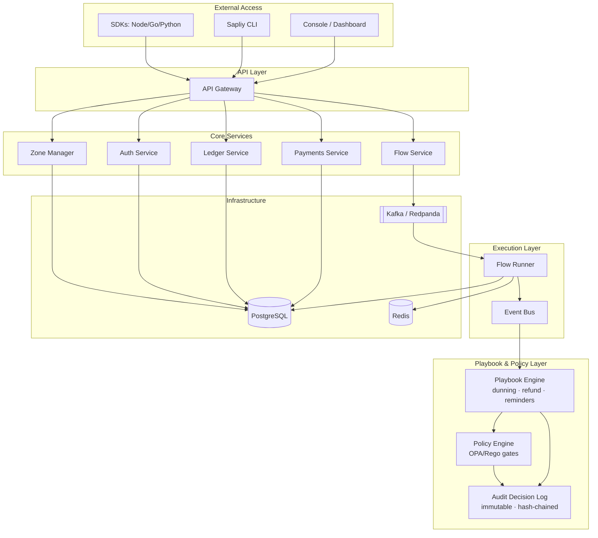

# System Architecture

Sapliy is a distributed, event-driven **Financial Operations Intelligence Layer**. It consists of multiple Go-based microservices that communicate via high-performance messaging systems, wrapped around a **Playbook Engine** that turns business intent into governed, auditable financial outcomes.

> Sapliy is an AI-native Financial Operations Intelligence Layer that turns business goals into reliable, explainable, auditable financial outcomes across Stripe, PayPal, Paddle, and the systems you already run. It is **not** a workflow builder and **not** a payment processor.

## The autonomation loop

At the top of the architecture sits the intent-driven orchestration path:

```
User intent ("recover failed payments")
        │
        ▼
Intent Preview + Confidence Gradient   ← humans approve before anything runs
        │
        ▼
Policy Engine (OPA/Rego)              ← deterministic gates: approvals, thresholds, risk
        │
        ▼
Execution Engine                      ← durable tasks, retries, idempotency, safe recovery
        │
        ▼
Audit Decision Log                    ← immutable, hash-chained, with the reason why
```

## Microservices Overview


```mermaid
graph TB
    subgraph "External Access"
        SDK[SDKs: Node/Go/Python]
        CLI[Sapliy CLI]
        UI[Console / Dashboard]
    end

    subgraph "API Layer"
        Gateway[API Gateway]
    end

    subgraph "Core Services"
        FlowSvc[Flow Service]
        AuthSvc[Auth Service]
        ZoneMgr[Zone Manager]
        LedgerSvc[Ledger Service]
        PaymentsSvc[Payments Service]
    end

    subgraph "Playbook & Policy Layer"
        Playbook[Playbook Engine<br/>dunning · refund · reminders]
        Policy[Policy Engine<br/>OPA/Rego gates]
        Audit[Audit Decision Log<br/>immutable · hash-chained]
    end

    subgraph "Execution Layer"
        Engine[Flow Runner]
        Events[Event Bus]
    end

    subgraph "Infrastructure"
        DB[(PostgreSQL)]
        Queue[[Kafka / Redpanda]]
        Cache[(Redis)]
    end

    SDK --> Gateway
    CLI --> Gateway
    UI --> Gateway

    Gateway --> AuthSvc
    Gateway --> ZoneMgr
    Gateway --> FlowSvc
    Gateway --> LedgerSvc
    Gateway --> PaymentsSvc

    Events --> Playbook
    Playbook --> Policy
    Policy --> Audit
    Playbook --> Audit

    FlowSvc --> Queue
    Queue --> Engine
    Engine --> Events
    Engine --> DB
    ZoneMgr --> DB
    AuthSvc --> DB
    LedgerSvc --> DB
    PaymentsSvc --> DB
    Engine --> Cache
```

### 1. API Gateway
The entry point for all external traffic. Handles:
- **Rate Limiting**: Per organization and per zone.
- **Authentication**: Validates API keys and JWTs.
- **Request Routing**: Proxies requests to internal gRPC/REST services.

### 2. Flow Service & Runner
- **Flow Service**: Manages the lifecycle of automation flows (CRUD, enable/disable, versioning).
- **Flow Runner (The Engine)**: A specialized worker that consumes events from the queue and executes logic. It is stateless and highly scalable.

### 3. Playbook Engine
The **intelligence layer** over the platform. It consumes unified financial events (`payment.failed`, `refund.requested`, `invoice.overdue`) and:
- Applies **deterministic playbook policies** (dunning retry schedule 4–6h then days 3/5/7, refund approval gates > $1,000 / 90-day rule, invoice reminder cadence).
- Records **every decision** — action, reason, policy applied, AI reasoning, confidence — in the hash-chained Audit Decision Log.

### 4. Policy Engine
Deterministic gate *before* execution. Implemented with **OPA/Rego** (with a hardcoded fallback), it validates every proposed action against company rules — so AI can recommend but never move money on its own.

### 5. Zone Manager
Maintains the logical isolation of environments. It ensures that data, keys, and execution contexts for "Test" and "Live" modes never intersect at the application layer.

### 6. Ledger Service
The source of truth for all financial state. It processes transaction events emitted by the Flow Runner and updates double-entry ledger records in PostgreSQL. Money is fixed-point **int64 cents** — never floats.

## Money & audit non-negotiables

- **Money = int64 cents** — fixed-point integers, never floats.
- **Double-entry ledger** as single source of truth.
- **Saga pattern** for distributed transactions with compensating actions.
- **Idempotency keys** on every mutation.
- **Immutable audit** with hash chaining + signature.

## Communication Patterns

- **Synchronous (REST/gRPC)**: Used for management actions (e.g., creating a flow, listing zones).
- **Asynchronous (Kafka/RabbitMQ)**: Used for event ingestion and flow execution. This ensures that a spike in payment events doesn't bring down the API.
- **Stateful (Redis)**: Used for idempotency checks, session management, and real-time execution tracking.

## Deployment Models

- **SaaS**: Multi-tenant architecture running on Sapliy's managed cloud.
- **Self-Hosted**: Packaged as Docker images and Helm charts for deployment in your own VPC (AWS, GCP, Azure, or On-prem).

## Related

- [Operational Playbooks](/playbooks/index)
- [Revenue Recovery & Dunning](/playbooks/revenue-recovery)
- [Refund Approval Orchestration](/playbooks/refund-approval)
- [Audit Decision Log](/playbooks/audit-decision-log)
- [Policy-as-Code](/guides/policy-as-code)
- [MCP](/guides/mcp)