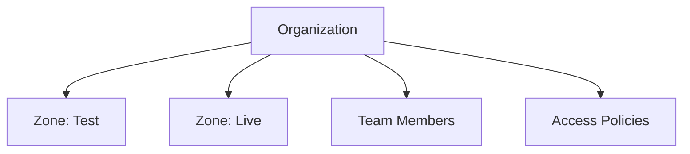

# Organizations

An **Organization** is the top-level entity in Sapliy. It represents your company or business unit.

## Hierarchy

## Responsibilities

The Organization is responsible for:
- **Billing**: All usage across zones is aggregated here.
- **Team Management**: Invite users and assign roles (RBAC).
- **Compliance**: Audit logs are stored at the org level.

## Creating an Organization

You typically create an organization when you sign up. Additional organizations can be created for separate business lines.
